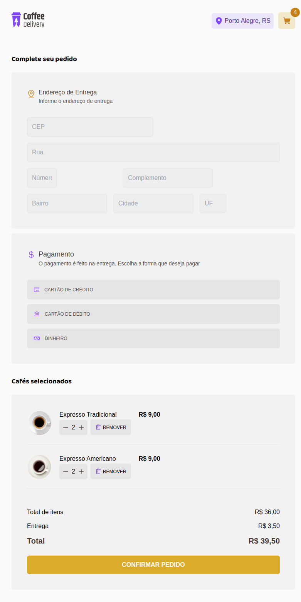

# Coffee Delivery

## Sobre o Projeto

Este projeto foi desenvolvido como parte do segundo desafio da trilha ReactJS do Ignite da Rocketseat. O objetivo principal é criar uma aplicação para gerenciar um carrinho de compras de uma cafeteria fictícia. As funcionalidades implementadas incluem a listagem de produtos (cafés), a adição e remoção de itens do carrinho, preenchimento de endereço e exibição do total de itens e valores no carrinho.

## Funcionalidades Implementadas

* Listagem de produtos (cafés): Exibe os produtos disponíveis para compra.
* Gerenciamento de Carrinho: O usuário pode adicionar uma quantidade específica de itens no carrinho, aumentar ou remover a quantidade, e os itens são atualizados automaticamente.
* Formulário de Endereço: O usuário pode preencher seu endereço para entrega.
* Resumo do Carrinho: Exibe o total de itens no carrinho e o valor total da compra, calculado com base na quantidade de itens e no preço unitário.
* Armazenamento Local: O estado do carrinho é mantido no LocalStorage, garantindo que as informações persistam ao atualizar a página.

## Conceitos Utilizados

* ReactJS: Utilizado para a construção da interface da aplicação, com foco em componentização e reutilização de código.
* ContextAPI: Para o gerenciamento global do estado do carrinho de compras.
* LocalStorage: Para persistência dos dados do carrinho.
* Imutabilidade do estado: Usado para garantir que o estado seja atualizado de forma segura e previsível.
* Manipulação de Arrays: A função reduce foi utilizada para calcular o valor total do carrinho.
* Tailwind CSS: Utilizado para a estilização dos componentes da aplicação.

## Tecnologias Utilizadas

* Vite
* ReactJS
* TypeScript
* ContextAPI
* React Hook Form
* Yup para validação
* Tailwind CSS

## Como Rodar o Projeto

Clone este repositório

```bash
git clone https://github.com/seu-usuario/coffee-delivery.git
```

Instale as dependências

```bash
npm install
```

Execute a aplicação

```bash
npm run dev
```

## Melhorias Futuras

* Implementar animações para melhorar a experiência do usuário.
* Adicionar novas funcionalidades como cupons de desconto.
* Melhorar a responsividade da aplicação.

## Layout

O layout da aplicação foi desenvolvido seguindo o design fornecido no Figma. Para visualizar o design original, acesse Coffee Delivery no Figma.

## imagens





## Conclusão

Este projeto me proporcionou a oportunidade de aplicar conceitos fundamentais do React, como a ContextAPI, imutabilidade do estado, e gerenciamento de formulários com validação. Foi uma excelente maneira de consolidar conhecimentos e praticar a criação de uma aplicação completa, do front-end à lógica de negócios.
